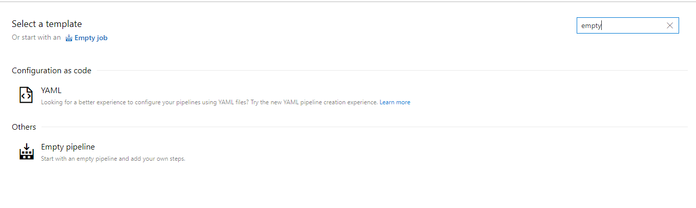
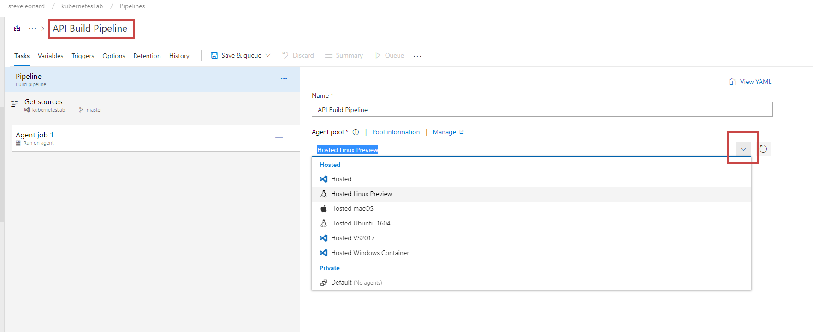
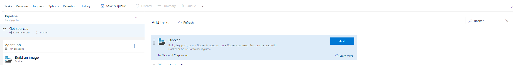
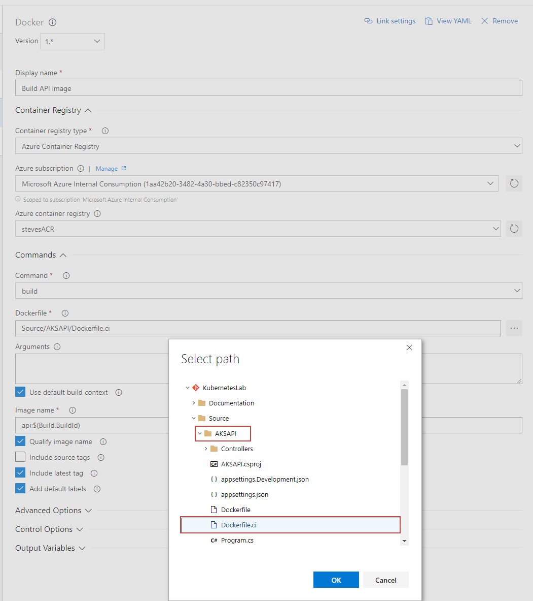
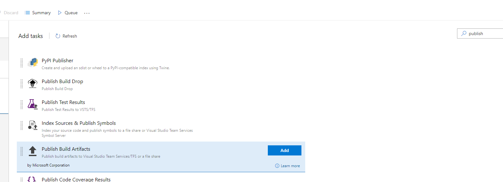
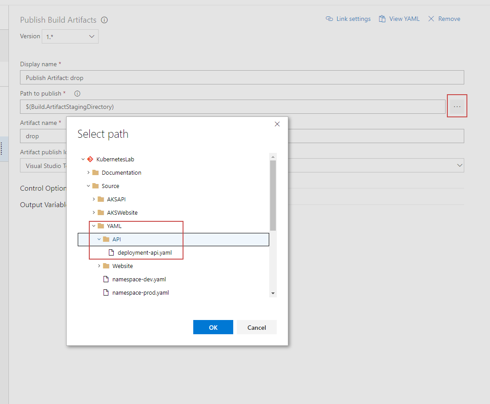
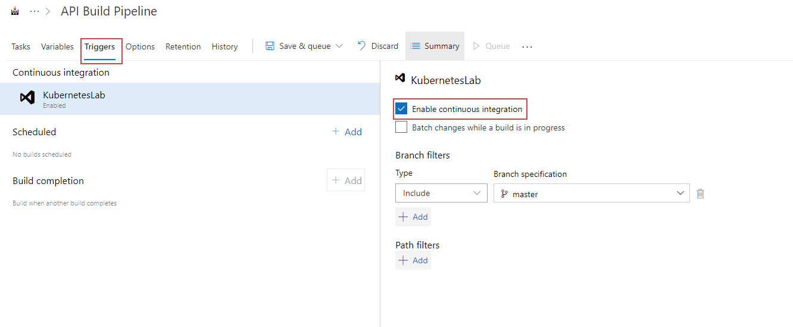

[](../../README.md)

# New API build pipeline


## Create empty piple line



### linux agent - name it



### add docker build step




### API build step



### Push API Build


### Publish Build Artificats



#### Choose the folder to publish




### Enable CI



### Trigger new build
Click save and queue

# New Website build pipeline

Follow the same steps as the API build pipeline line with the following changes: 

1. Set the title as ```Website Build Pipeline```
2. Set the Docker File in the docker build steps as ```Source/AKSWebsite/Dockerfile.ci```
3. Set the Image Name in the docker build steps to ```website:$(Build.BuildId)```
4. Set the Path to Publish in the Publish Artifacts step to ```Source/YAML/Website```


# Next Steps 
### [Create Release Pipelines](../ReleasePipelines)