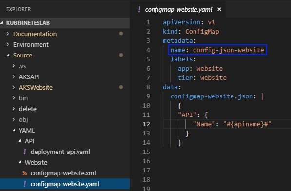
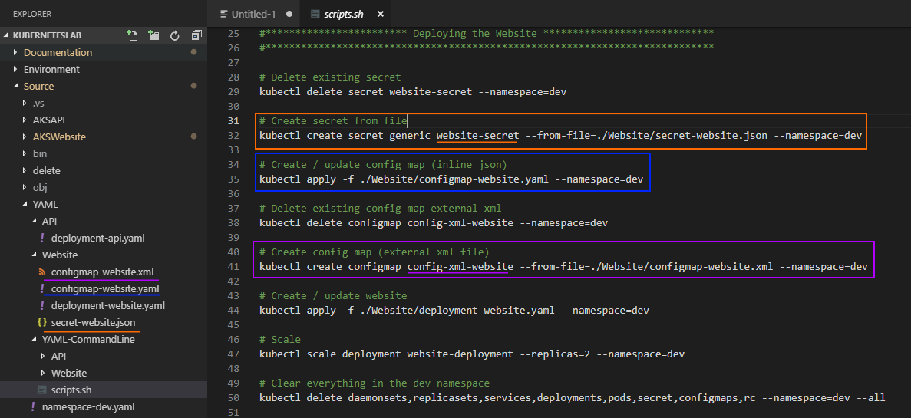
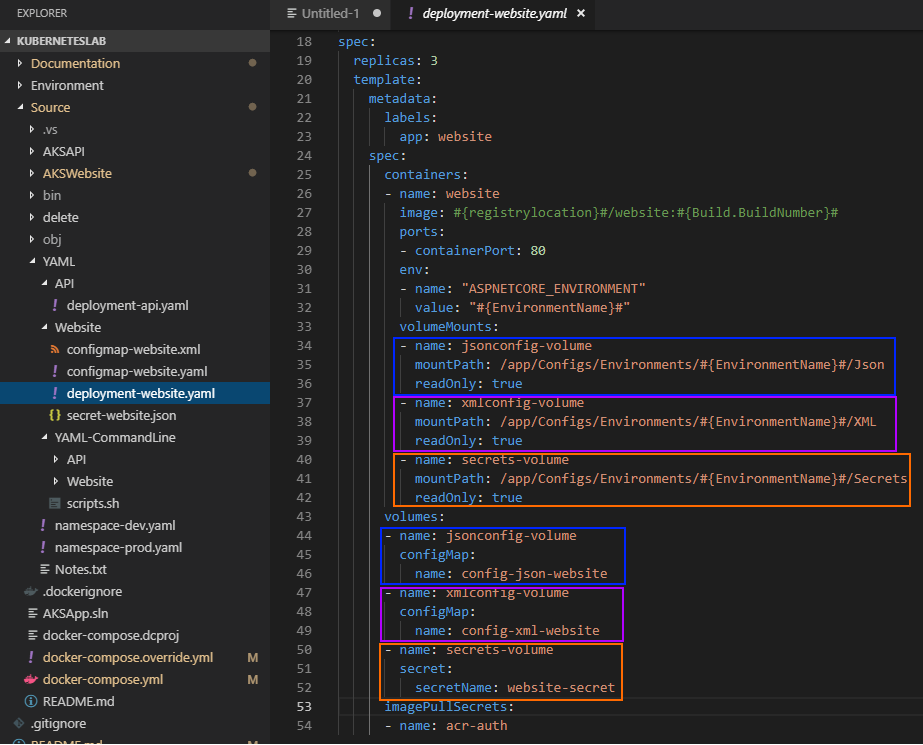

[](../../README.md)


## Volume Mounts, YAML, Config Maps and Secrets

The ```configmap-website.json``` file is defined inside a YAML file named **configmap-website.yaml** and the JSON document sits within this file under the data property. 

 

There's also two other config files within the solution named:

* configmap-website.xml
* secret-website.json

The screen shot below shows we can create **Config Maps** and **Secrets** inside Kubernetes for these files using the Kubernetes CLI

 

Finally, within the YAML template for our website we are referencing these named Config Maps and Secrets and Mounting them into our chosen path within our containers application. 

 


# Next Steps

### [Working with the Kubernetes CLI](../WorkingWithTheKubernetesCLI)
