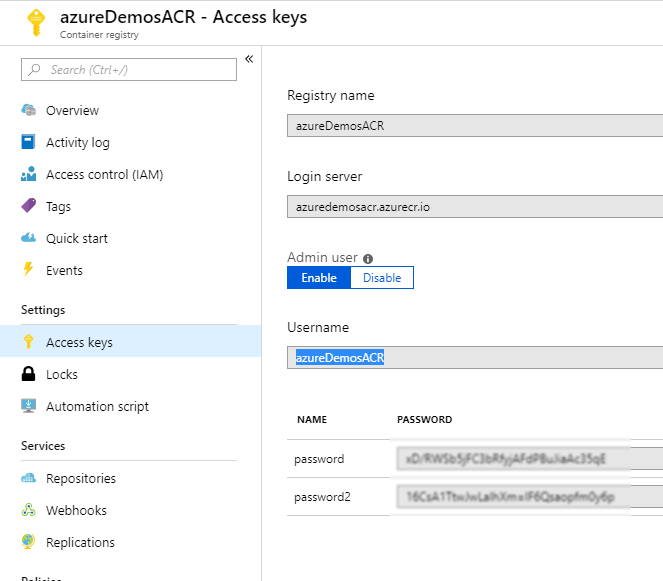

[](../../../README.md)

# Setting up your environment using the Azure CLI

Before starting you should have already installed the Azure CLI and logged in.

## Running the script

In the terminal run the following command at the root directory

```
./Environment/cli/run.sh
```

This will now provision your environment for the lab.

#### Thoubleshooting 

If you have difficulties creating the Service Principal, you can enable the admin user role for your Azure Container Registry and use the UserName and Password in place of the ```<service-principal-ID>``` and ```<service-principal-password>```

Although this will work, the reason we didn't recommend doing this in the first place is because the service principal only has read accesss, where as the admin user role will have full access to the registry. 



More info on this subject can be found here at  https://docs.microsoft.com/en-us/azure/container-registry/container-registry-auth-aks

# Next Steps 

### [Looking into the code](../../LookingIntoTheCode)
