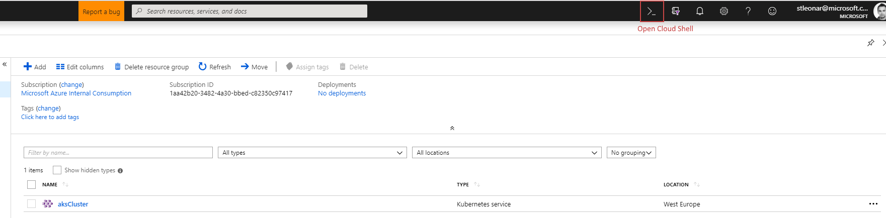
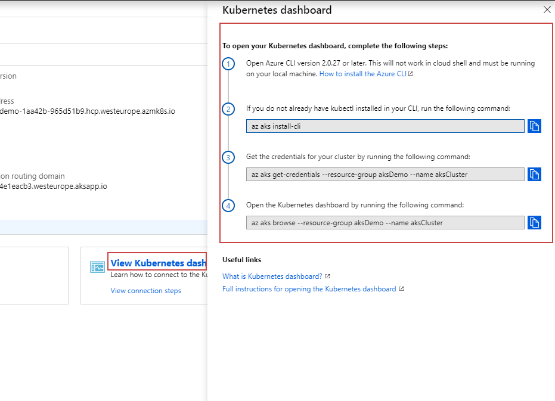

[](../../../README.md)

# Setting up your environment using the Azure CLI

Before starting you should have already installed the Azure CLI and logged in. 

## Create resource group
All resources within Azure are added to a Resource Group. 
We can create a Resource Group using the CLI as shown below.

```
az group create --name aksDemo --location westeurope
```

## Create cluster with application routing and role based access control

Create a cluster with default settings

```
az aks create --resource-group aksDemo --name aksCluster --node-count 3 --enable-addons http_application_routing --generate-ssh-keys -r
```

> There are additional options that can be chosen to create an AKS cluster such as VM sizes. 

## Create an Azure Container Registry

Later we will want to push our Docker images into a Registry. We could use Docker Hub, alternatively Azure has its own container registry. 

It may be worthwhile putting the registry in a different Resource Group to the cluster. This way you can create different clusters for multiple environments and delete them as required without losing all of your Docker images in your registry. 

```
# Create Resource Group
az group create --name acrDemo --location westeurope

# Create Azure Container Registry (ACR)
az acr create --resource-group acrDemo --name azureDemosACR --sku Basic
```

## Authenticate with Azure Container Registry from Azure Kubernetes Service

When you're using Azure Container Registry (ACR) with Azure Kubernetes Service (AKS), an authentication mechanism needs to be established. 

Run this script in the Azure Portal cloud shell to create a new service principal with read only access to your registry. Make sure to replace ```<YOUR_ACR_NAME>``` with the name of your registry.



```
#!/bin/bash

ACR_NAME=<YOUR_ACR_NAME>
SERVICE_PRINCIPAL_NAME=<YOUR_ACR_NAME>-acr-service-principal

# Populate the ACR login server and resource id.
ACR_LOGIN_SERVER=$(az acr show --name $ACR_NAME --query loginServer --output tsv)
ACR_REGISTRY_ID=$(az acr show --name $ACR_NAME --query id --output tsv)

# Create a 'Reader' role assignment with a scope of the ACR resource.
SP_PASSWD=$(az ad sp create-for-rbac --name $SERVICE_PRINCIPAL_NAME --role Reader --scopes $ACR_REGISTRY_ID --query password --output tsv)

# Get the service principal client id.
CLIENT_ID=$(az ad sp show --id http://$SERVICE_PRINCIPAL_NAME --query appId --output tsv)

# Output used when creating Kubernetes secret.
echo "Service principal ID: $CLIENT_ID"
echo "Service principal password: $SP_PASSWD"
```
> Make sure to take note of the Service principal ID and Service principal password from the output

### Create a Kubernetes Secret

Now we've created a service principal that has read access to our registry, we can create an image pull secret in Kubernetes that the deployments will use later.

#### Connecting to AKS

First you will need to connect to your cluster. Open the portal, navigate to your AKS cluster, then click on the "View Kubernetes Dashboard" link and follow the instructions.



Once your command window is connected to your cluster we can run a command to install a secret into the cluster. The email address can be anything.

```
kubectl create secret docker-registry acr-auth --docker-server <acr-login-server> --docker-username <service-principal-ID> --docker-password <service-principal-password> --docker-email <email-address>
```

#### Thoubleshooting 

If you have difficulties creating the Service Principal, you can enable the admin user role for your Azure Container Registry and use the UserName and Password in place of the ```<service-principal-ID>``` and ```<service-principal-password>```

Although this will work, the reason we didn't recommend doing this in the first place is because the service principal only has read accesss, where as the admin user role will have full access to the registry. 


More info on this subject can be found here at  https://docs.microsoft.com/en-us/azure/container-registry/container-registry-auth-aks


# Review

Now you should have successfully created a Kubernetes cluster (AKS) and an Azure Container Registry (ACR) to store your Docker images. You have also given AKS the authenicated required to pull images from your private ACR. 


# Next Steps 
### [Setup Azure DevOps project](../../DevOpsSetup)