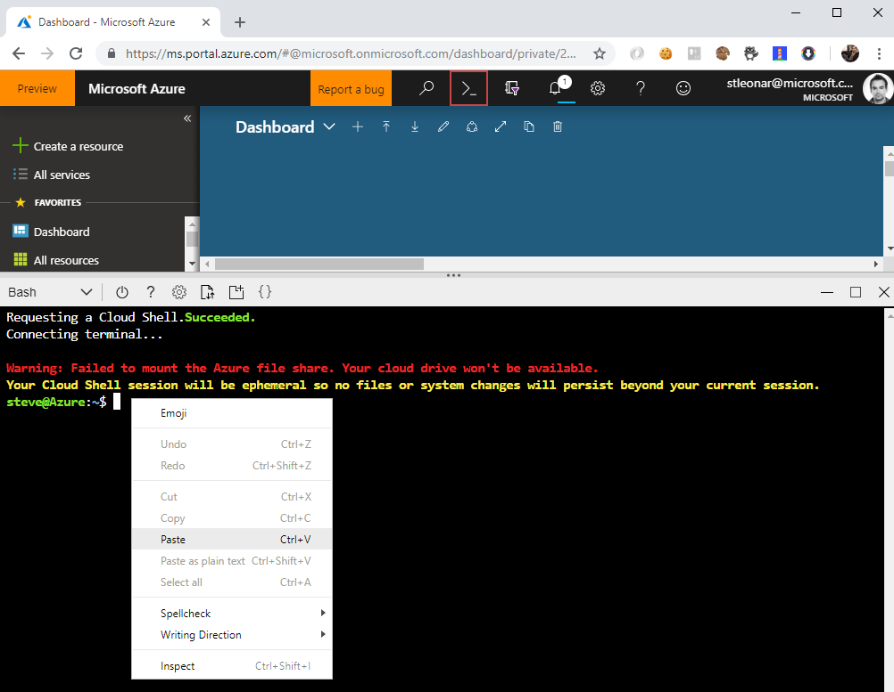

[](../../README.md)

# Setting up your environment

## Environment provisioning options

There are several approaches you can use to provision your environment, including ARM templates, PowerShell, Terraform and Azure CLI. They all have their advantages and disadvantages which is a whole sperate topic. 

For the sake of this lab with have included two detailed labs using Azure CLI and Terraform, and a quickstart single script that can run in the Azure Portal Cloud Shell. 

## Quick Start - Single Azure Cloud Shell Bash Script

To Create all the resources needed for the lab in Azure, login into the Azure Portal and open the cloud shell highlighted with the red box in the screenshot below.

Copy the script below and replace ```<enter-a-unique-name-here>``` with your own resource group name without dashes or underscores. Then right click on the Cloud Shell bash window and paste in the script. 



```
# Set a unquique Resource Group name - THIS CANNOT HAVE Dashes OR Underscores
RG_NAME=<enter-a-unique-name-here>
 
#Create Resource Group
az group create --name $RG_NAME --location westeurope
 
# Create Container Registry (ACR)
ACR_Name="${RG_NAME}ACR"
az acr create --resource-group $RG_NAME --name $ACR_Name --sku Basic
 
# Create Service Principal (SP)
SERVICE_PRINCIPAL_NAME="${ACR_Name}-acr-service-principal"
 
# Get the ACR login server URI and resource id.
ACR_LOGIN_SERVER=$(az acr show --name $ACR_Name --query loginServer --output tsv)
ACR_REGISTRY_ID=$(az acr show --name $ACR_Name --query id --output tsv)
 
# Create a 'Reader' role assignment with a scope of the ACR resource.
SP_PASSWD=$(az ad sp create-for-rbac --name $SERVICE_PRINCIPAL_NAME --role Reader --scopes $ACR_REGISTRY_ID --query password --output tsv)
 
# Get the service principal client id.
CLIENT_ID=$(az ad sp show --id http://$SERVICE_PRINCIPAL_NAME --query appId --output tsv)
 
# Output used when creating Kubernetes secret.
echo "Service principal ID: $CLIENT_ID"
echo "Service principal password: $SP_PASSWD"
 
# Create Cluster
AKS_Name="${RG_NAME}-akscluster"
az aks create --resource-group $RG_NAME --name $AKS_Name --node-count 3 --enable-addons http_application_routing --generate-ssh-keys --kubernetes-version 1.12.4
 
# Connect to cluster
az aks get-credentials --resource-group $RG_NAME --name $AKS_Name
 
# Create Namespaces
kubectl create --namespace=dev -f https://raw.githubusercontent.com/AzureDemos/KubernetesLab/master/Source/YAML/namespace-dev.yaml
kubectl create --namespace=prod -f https://raw.githubusercontent.com/AzureDemos/KubernetesLab/master/Source/YAML/namespace-prod.yaml

# Create secret to connect to ACR for each namespace and the default
kubectl create secret docker-registry acr-auth --docker-server $ACR_LOGIN_SERVER --docker-username $CLIENT_ID --docker-password $SP_PASSWD --docker-email k8slab@azuredemos.com
kubectl create secret docker-registry acr-auth --docker-server $ACR_LOGIN_SERVER --docker-username $CLIENT_ID --docker-password $SP_PASSWD --docker-email k8slab@azuredemos.com --namespace=dev
kubectl create secret docker-registry acr-auth --docker-server $ACR_LOGIN_SERVER --docker-username $CLIENT_ID --docker-password $SP_PASSWD --docker-email k8slab@azuredemos.com --namespace=prod

# Create ClusterRoleBinding for Dashboard
kubectl create clusterrolebinding kubernetes-dashboard -n kube-system --clusterrole=cluster-admin --serviceaccount=kube-system:kubernetes-dashboard


```
This script can take upto half an hour to run, but once its finished you should have a new resource group with an Azure Container Registry and an AKS Cluster. 

The cluster will have 'dev' and 'prod' namesapces installed along with a secret that enables it to pull images down from your private Azure Container Registry. 


# Review

Now you should have successfully created a Kubernetes cluster (AKS) and an Azure Container Registry (ACR) to store your Docker images. You have also given AKS the authentication required to pull images from your private ACR. 


# Next Steps 

### [Looking into the code](../LookingIntoTheCode)


---
---


# Additional Deployment Options

> This section is **NOT REQUIRED** for the lab

## Detailed Step by Step Instructions

Alternatively, if you have more time and want to understand how we create each component, then you can follow the more detail step by step instructions for the Azure CLI or Terraform. 

### Login with the Azure CLI

Before running through either of the options below you first need to login using the Azure CLI

```
az login
```

You then have the optional step of setting which subscription you would like to use in the current context.

```
az account set --subscription {subscription_guid}
```

### [1. Using the Azure CLI](AzureCLI)

### [2. Using Terraform](Terraform)

