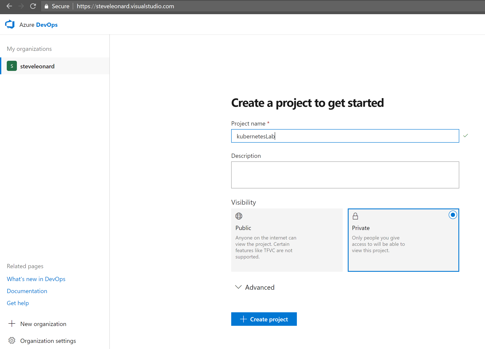

[](../../README.md)

# Azure DevOps Service

Azure DevOps is free service for Open Source projects that is split into five areas:

* Pipelines - CI/CD that works with any language. Connect to any Git repository.

* Boards- Powerful work tracking with Kanban boards, backlogs, team dashboards, and custom reporting

* Artifacts - Maven, npm, and NuGet package feeds from public and private sources.

* Repos - Unlimited cloud-hosted private Git repos for your project. 

* Test Plans - All in one planned and exploratory testing solution.

You can create an accout at https://azure.microsoft.com/en-us/services/devops/

## Create Azure DevOps Project

Once logged into Azure DevOps Service, create a new project for this lab.



## Import Repo

Although we can trigger builds from the public Git repo, it makes more sense for a Lab for each user to import there own version of the code, so you can make your own changes and release them into your own cluster without effecting anyone else. 

To do this, select "import a repository", chose Git as the source and paste ```https://github.com/AzureDemos/KubernetesLab.git``` into the Clone URL


# Review

Now you should have created an Azure DevOps account or logged into an existing one, created a new project for this lab and imported the code from our public GitHub repository into your project. 


# Next Steps 

### [Looking into the code](../LookingIntoTheCode)