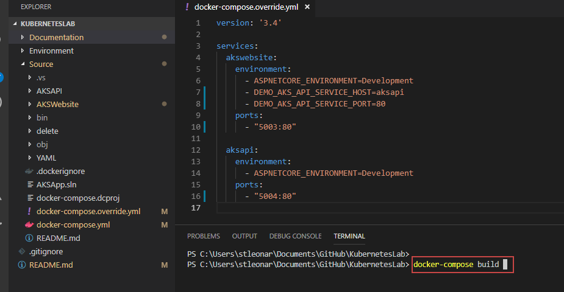

[](../../README.md)

# Running the Code Locally

Open the project in Visual Studio Code and navigate to ```/Source/docker-compose.override.yml``` file in the Explorer window then right click and select 'Open in Terminal'


In the terminal run the command ```docker-compose build```



Now run the command ```docker-compose up```


Finally Navigate to ```http://localhost:5003``` in your browser window

## Binding the Configs when running locally

The application contains several different types of config files from JSON and XML documents to environment variables. The app knows which root folder to find these in by checking the ```ASPNETCORE_ENVIRONMENT``` environment variable and reading for all sub folders within it.

When deploying the application into Kubernetes we can use **Config Maps** and **Secrets** to inject these files into the folder the app it reading.

When we run the code locally the ```ASPNETCORE_ENVIRONMENT``` environment variable is set to **Development**


## Configs when running in AKS

When the the website is deployed into AKS we set the ```ASPNETCORE_ENVIRONMENT``` environment variable to **Kubernetes**

Then we can use Config Maps and Secrets to mount the same files (with different values) under a folder called Kubernetes. 


> It's important to understand here, that the container which will eventually be stored in a Container Registry **does not contain the folder named AKS or any of the config files.** The AKS folder and the JSON and XML files are mounted into the contain by Kubernetes and therefore, we can change these per environment in our CI/CD pipelines without re-building the container.

## Loading the Config

The application start up uses the environment name to determine the location of the configs. See below


When running in debug this location is Development, but within our YAML files we will set the environment name to match the location of the configs folder as shown below. 


> Note, our release pipelines will replace the value ```#{EnvironmentName}#``` with values defined for each environment 


## IOC / Dependency Injection

Two Services have been created: 

1. Service Locator - This returns the URI of any other service in the cluster if you pass its name
2. APIService - A class that will make a HTTP Get to our API and return the result


Within the ConfigureServices method we have registered these services and the configuration into the IOC container, so they can be injected into our HomeController.cs


### The IServiceLocator Interface

Kubernetes adds Environment variables to a Pod for service discovery in the format ```{SERVICENAME}_SERVICE_HOST``` and ```{SERVICENAME}_SERVICE_PORT``` where the service name is upper-cased and dashes are converted to underscores.

Our API name is provided to us in the **configmap-frontend.json** and is set too ```Demo-AKS-API```

Therefore Kubernetes injects the following environment variables into our Pod ```DEMO_AKS_API_SERVICE_HOST``` + ```DEMO_AKS_API_SERVICE_PORT```

The ServiceLocator.cs implimentation of IServiceLocator uses these environment variable to discover the location of the API.

When running the code locally in docker compose (Not Kubernetes), we inject these environment variables into the container


> Note, when running the app outside of Kubernetes we can always switch the implimentation of IServiceLocator to a different class if required


## Home Controller

The HomeController takes the Configuration, ServiceLocator and APIService in its constructor.
It then call thes API and builds a Model to display the config to the user and the response from the API


# Next Steps

### [Building YAML Templates](../BuilingYAMLTemplates)
