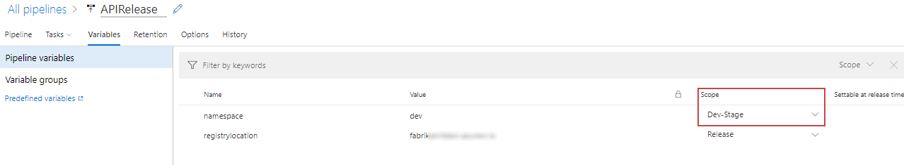
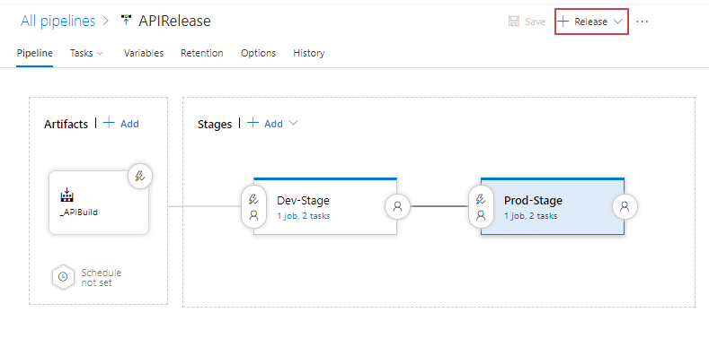
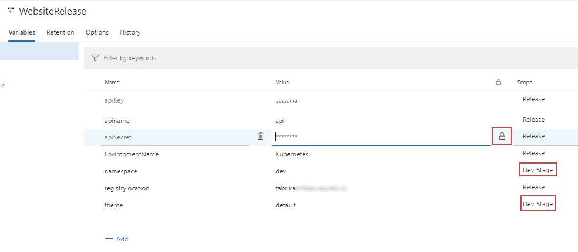
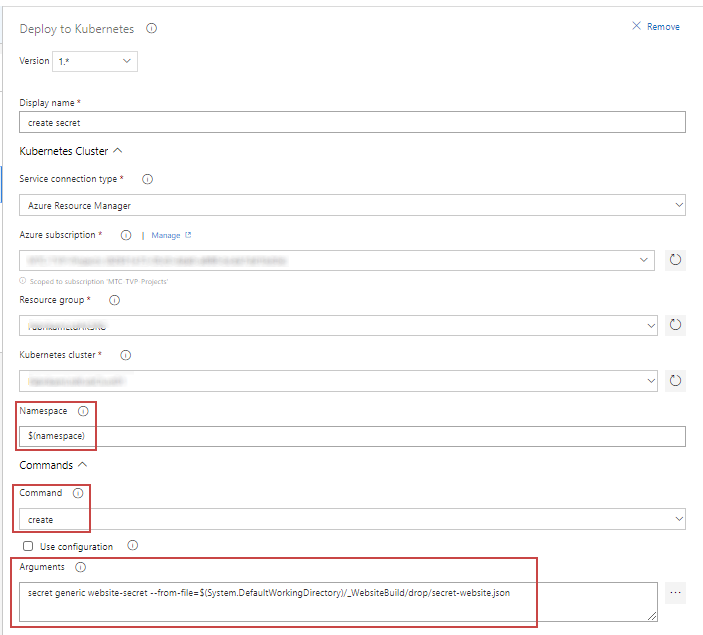
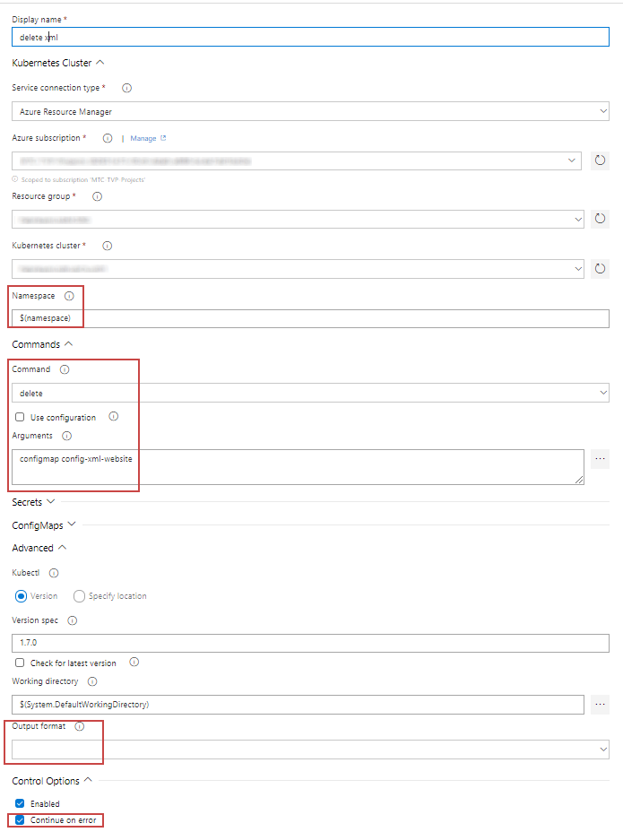

[](../../README.md)

# Release Pipelines

Here we are going to create a release pipeline for the API and the Website which will be triggered from our build pipelines. 
Essentially these pipelines are using deploying the YAML files from our build artifacts using the Kubernetes CLI as we did manually in the [Working with the Kubernetes CLI Stage](../WorkingWithTheKubernetesCLI)


Other than the fact its all automated the main difference here, is that we will change the placeholder values in the configs and YAML templates with variables we set for each stage of the deplpyment (Dev, UAT, Pre-Prod, Prod, etc)


## First install the Replace Tokens addon if you do not already have it

https://marketplace.visualstudio.com/items?itemName=qetza.replacetokens


# Create Kubernetes Release Pipeline

## 1. Create New Release and Choose Deploy to Kubernetes Cluster

This will create Stage 1, you can rename this stage to whatever you like, for example Dev, UAT, Pre-Prod, etc


 > Once created click on the little pen where it says "New release pipeline" and rename the release to "API Release"


## 2. Select Artifact


## 2.1. Choose the API Build as the arftifacts for this release


## 3. Setup Continous Deployment by clicking on the lightening bolt 


### 3.1.  Check the enable button to create a release evrytime a build is available


## 4. Add Variables

Add two variables

* registrylocation - set the value to your ACR login server uri
* namespace - set this to ```dev``` and change the scope to the name of your first stage



## 5. Click into the Tasks for Dev Stage (Stage 1)


## 6. Add Replace Tokens Task
Click the plus icon next to "Agent Job" to add a new task and search for "replace"

> This addon needs to have been installed - https://marketplace.visualstudio.com/items?itemName=qetza.replacetokens

In the List of tasks on the left, drag the Replace Tokens to the top


### 6.1. Edit the replace tokens task

Set the target files to equal
```
**/*.yaml
**/*.json
**/*.xml
```

This task will find all files in our artifacts that are YAML, Json or XML and then replace any values that match a pattern ```#{somethingToBeReplaced}#``` with the variables we have set 


## 7. Edit the Kubectl Apply Task

1. Choose your subscription from the Azure Subscription drop down menu
2. Choose the Resource Group that your AKS cluster belongs to in the Resource Group drop down menu
3. Choose your cluster from the Kubernetes cluster drop down menu
4. Type ```$(namespace)``` into the Namespace (this will be replaced by the variable for this stage which is 'dev'. You should have already have created a dev namespace during the creating your environment section)
5. Tick the box labelled "use configuration files" and then select the deployment-api.yaml file


## 8. Save the changes made to your release 

## 9. Clone this Stage

Click on the 'Pipeline' tab and hove over the dev stage. Two buttons should appear and once will say clone. Click this button. Then rename the new stage to 'Prod Stage'


### 9.1 Set any Scoped variables for the new stage

You should now see that a second namespace variable has been added for the new Prod-Stage.
Set this to ```prod```

> This means the API will be deployed into the Dev namespace in the first stage of our deployment and the prod namespace in the second stage of our deployment. 


# 10. Save & Trigger a new Release




# Create the Website Release

The release for the website is a little more complex as the service has more configuration, which we will inject into the container using config maps and secrets. 

## 1. Repeat Steps 1-5 of the API build
This time choose the Website build as the artifact and name the release "Website Release"

## 2. Set the variable for this release

1. Choose your ACR login server uri and set the api key and secret to whatever you like, as it is only for demo purposes. 
2. Themes can be Default or Blue or Red
3. Tick the lock button next to APIKey and Secret to hide the values



## 3. Add Replace Tokens Task

Do the same as in Step 6 of the API release and make sure that this task is dragged to the top of all tasks

## 4. Deploy a Kubernetes Secret into the Cluster

### 4.1. Add a new Kubernetes Task

Add a new task to the stage by clicking the plus icon next to the Agent Job and search for Kubernetes


### 4.2. Delete the existing secret if it exists

Edit the new task and set the following properties:

1. Name the task ```delete secret```
2. Choose your subscription from the Azure Subscription drop down menu
3. Choose the Resource Group that your AKS cluster belongs to in the Resource Group drop down menu
4. Choose your cluster from the Kubernetes cluster drop down menu
5. Type ```dev``` into the Namespace (you should have already created a dev namespace during the creating your environment section)
6. Command - delete
7. Arguments - ```secret website-secret```
8. Output format - keep this empty
9. Check the box labelled "Continue on error"


### 4.3. Deploy a new Secret 

Add a new task Kubernetes task and Edit it with the following:

1. Name the task ```create secret```
2. Choose your subscription from the Azure Subscription drop down menu
3. Choose the Resource Group that your AKS cluster belongs to in the Resource Group drop down menu
4. Choose your cluster from the Kubernetes cluster drop down menu
5. Type ```dev``` into the Namespace (you should have already created a dev namespace during the creating your environment section)
6. Command - Create
7. Arguments - ```secret generic website-secret --from-file=<Location of secret-website.json here>```

> Tip - To find the location of secret-website.json check the box labelled use configuration files and then select the secret-website.json from the popup window. Copy and paste this into the arguments and then un-check the check box again



> Tip - to find the correct path of the secret-website.json file, check the tick box labelled "use configurations" box above and select the file, copy the location back into the arguments, then un-check the use configurationsbox

## 5. Deploy the XML Config Map


### 5.1. Add a new Kubernetes Task

Add a new task to the stage by clicking the plus icon next to the Agent Job and search for Kubernetes

### 5.2. Delete the existing config map

Edit the new task and set the following properties:

1. Name the task ```delete xml config map```
2. Choose your subscription from the Azure Subscription drop down menu
3. Choose the Resource Group that your AKS cluster belongs to in the Resource Group drop down menu
4. Choose your cluster from the Kubernetes cluster drop down menu
5. Type ```dev``` into the Namespace (you should have already created a dev namespace during the creating your environment section)
6. Command - delete
7. Arguments -  ```configmap config-xml-website``
8. Output format - keep this empty
9. Check the box labelled "Continue on error"



### 5.3. Deploy a new XML Config Map 

Add a new task Kubernetes task and Edit it with the following:

1. Name the task ```create xml config map```
2. Choose your subscription from the Azure Subscription drop down menu
3. Choose the Resource Group that your AKS cluster belongs to in the Resource Group drop down menu
4. Choose your cluster from the Kubernetes cluster drop down menu
5. Type ```dev``` into the Namespace (you should have already created a dev namespace during the creating your environment section)
6. Command - Create
7. Arguments - ```configmap config-xml-website --from-file=<Location of configmap-website.xml here>```


> Again use the "Use configuration files" check box to discover the location of the file

## 6. Create Json Config Map

Add a new task Kubernetes task and Edit it with the following:

1. Name the task ```create json config map```
2. Choose your subscription from the Azure Subscription drop down menu
3. Choose the Resource Group that your AKS cluster belongs to in the Resource Group drop down menu
4. Choose your cluster from the Kubernetes cluster drop down menu
5. Type ```dev``` into the Namespace (you should have already created a dev namespace during the creating your environment section)
6. Command - apply
7. Check the "Use Configuration Files" box and select the configmap-website.yaml file


## 7. Deploy the Website

Add a new task Kubernetes task and Edit it with the following:

1. Name the task ```deploy website```
2. Choose your subscription from the Azure Subscription drop down menu
3. Choose the Resource Group that your AKS cluster belongs to in the Resource Group drop down menu
4. Choose your cluster from the Kubernetes cluster drop down menu
5. Type ```dev``` into the Namespace (you should have already created a dev namespace during the creating your environment section)
6. Command - apply
7. Check the "Use Configuration Files" box and select the deployment-website.yaml file


## 8. Trigger a new Release

Finally save the changes and click on the Release button to trigger a new release

# Review

After following these steps you should now have two release pipelines that are triggered from your builds. These pipelines replace values in your YAML build artifacts with variables in your release (Per Environment if required) and then deploy the config maps, secrets and services into the dev namespace of your cluster.


# Next Steps 
### [Make a code change by adding Application Insights](../AddApplicationInsights)
