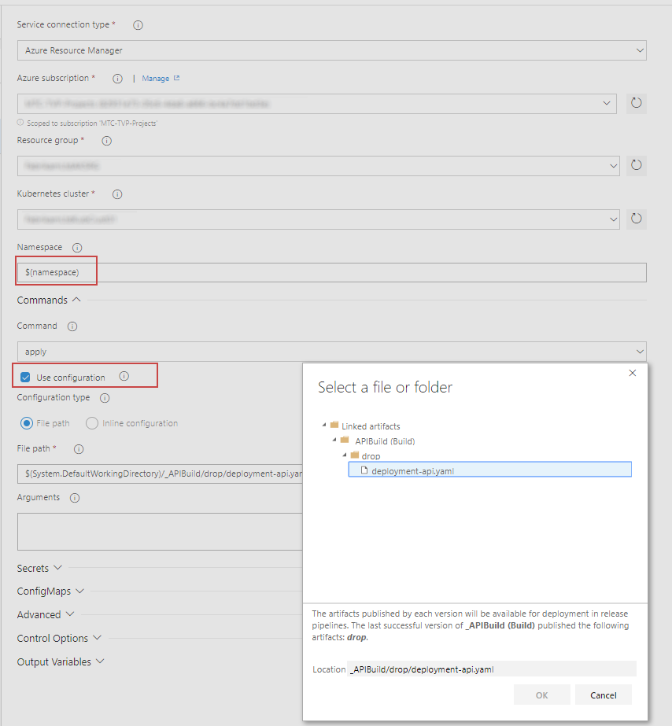

[](../../README.md)

# Release Pipelines

## Replace Tokens
https://marketplace.visualstudio.com/items?itemName=qetza.replacetokens


## Create Kubernetes Release Pipeline

### 1. Create New Release and Choose Deploy to Kubernetes Cluster


 > Once created click on the little pen where it says "New release pipeline" and rename the release to "API Release"
### 2. Select Artifact


### 3. Choose the API Build as the arftifacts for this release


### 4. Setup Continous Deployment by clicking on the lightening bolt 


### 5. Check the enable button to create a release evrytime a build is available


### 6. Add Variables

For the registry location set the value to your ACR login server uri


### 7. Click into the Tasks for Stage 1


### 8. Add Replace Tokens Task
Click the plus icon next to "Agent Job" to add a new task and search for "replace"
This addon needs to have been installed - https://marketplace.visualstudio.com/items?itemName=qetza.replacetokens

In the List of tasks on the left, drag the Replace Tokens to the top


### 9. Edit the replace tokens task

Set the target files to equal
```
**/*.yaml
**/*.json
**/*.xml
```

This task will find all files in our artifacts that are YAML, Json or XML and then replace any values that match a pattern ```#{somethingToBeReplaced}#``` with the variables we have set in Step 6


### 10. Edit the Kubectl Apply Task

1. Choose your subscription from the Azure Subscription drop down menu
2. Choose the Resource Group that your AKS cluster belongs to in the Resource Group drop down menu
3. Choose your cluster from the Kubernetes cluster drop down menu
4. Type ```dev``` into the Namespace (you should have already created a dev namespace during the creating your environment section)
5. Tick the box labelled "use configuration files" and then select the deployment-api.yaml file



### 11. Save the changes made to your release 

### 12. Trigger a new Release


## Create the Website Release

The release for the website is a little more complex as the service has more configuration, which we will inject into the container using config maps and secrets. 

### 1. Repeat Steps 1-5 of the API build
This time choose the Website build as the artifact and name the release "Website Release"

### 2. Set the variable for this release

1. Choose your ACR login server uri and set the api key and secret to whatever you like, as it is only for demo purposes. 
2. Themes can be Default or Blue or Red
3. Tick the lock button next to APIKey and Secret to hide the values


# Next Steps 
### [Make a code change by adding Application Insights](../AddApplicationInsights)