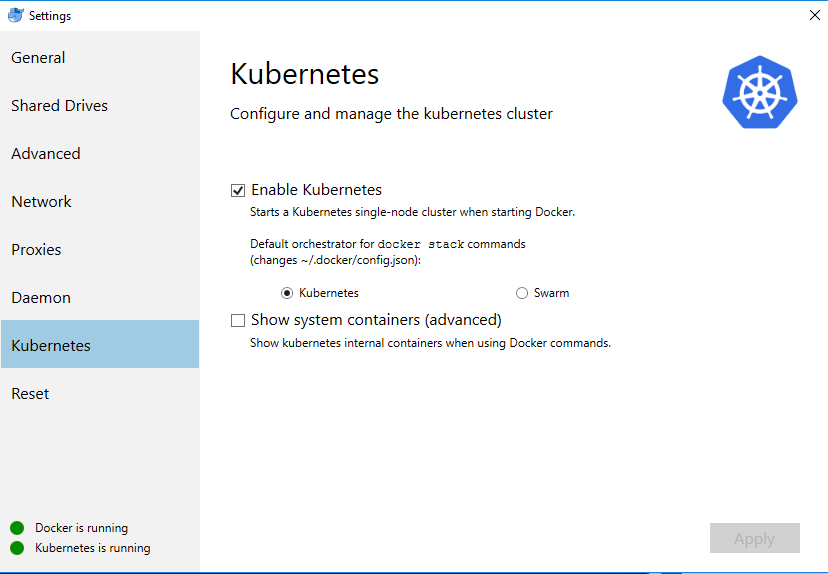

## Setup Docker for Windows

Install Docker for Windows - link

Enable Kubernetes




### Alternativly, via the CLI 

You can view all contexts
```
kubectl config view
```

View you current context

```
kubectl config current-context  
```

Switch your current context

```
kubectl config use-context context-name-here
```

## Viewing you local dashboard

Firstly make sure you have installed the dashboard UI

```
kubectl create -f https://raw.githubusercontent.com/kubernetes/dashboard/master/src/deploy/recommended/kubernetes-dashboard.yaml
```

Now setup a proxy

```
kubectl proxy
```

Your dashboard will be made available here: http://localhost:8001/api/v1/namespaces/kube-system/services/https:kubernetes-dashboard:/proxy/


### [Next Step - Creating AKS Cluster with Azure CLI](createcluster)