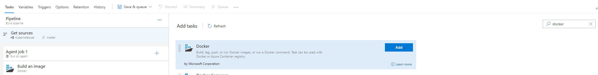
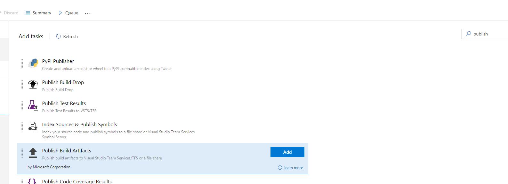

## New build pipeline

Create empty piple line

linux agent - name it

add docker build step

API build step

Push API Build

Publish Build Artificats

Choose the folder to publish

Enable CI

# Next Steps 
### [Create Release Pipelines](releasepipelines.md)