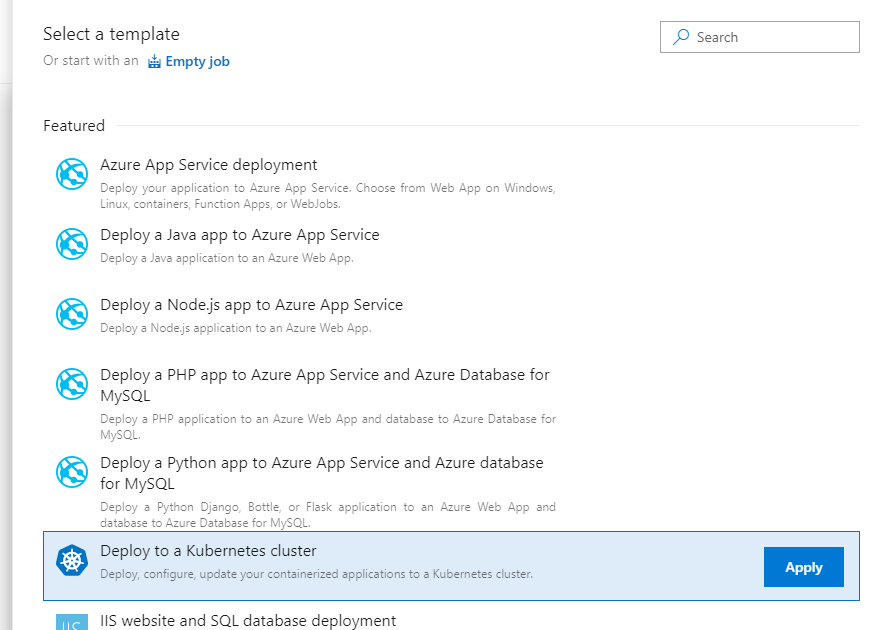
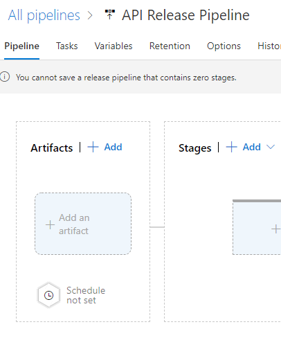
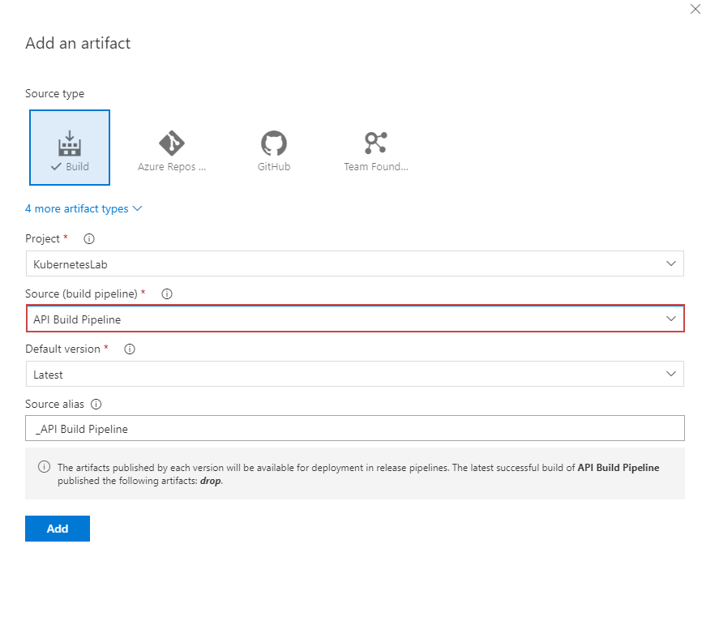
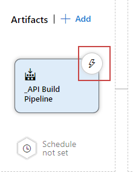
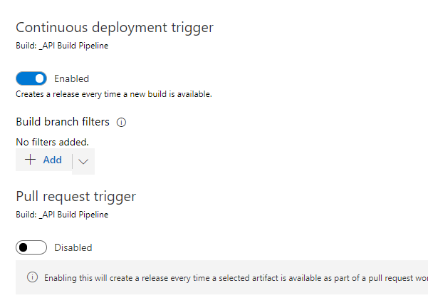
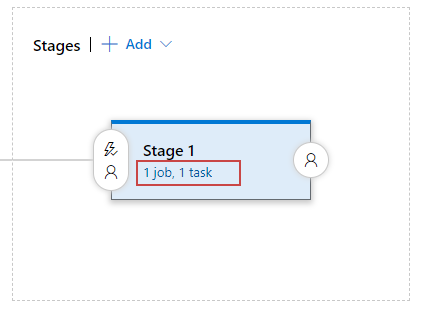
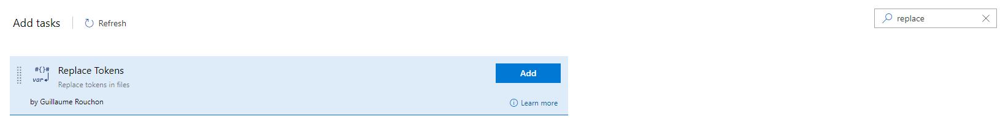

# Release Pipelines

## Replace Tokens
https://marketplace.visualstudio.com/items?itemName=qetza.replacetokens

## Create Kubernetes Release Pipeline

## Select Artifact

# Next Steps 
### [Make a code change by adding Application Insights](codechanges.md)