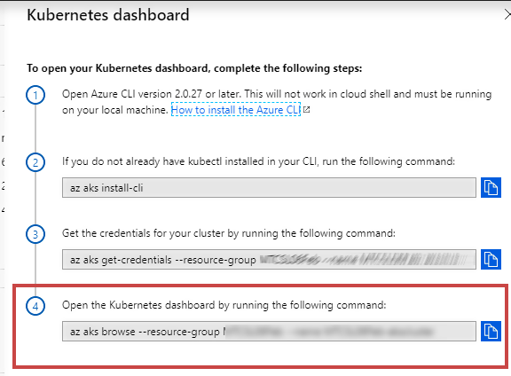
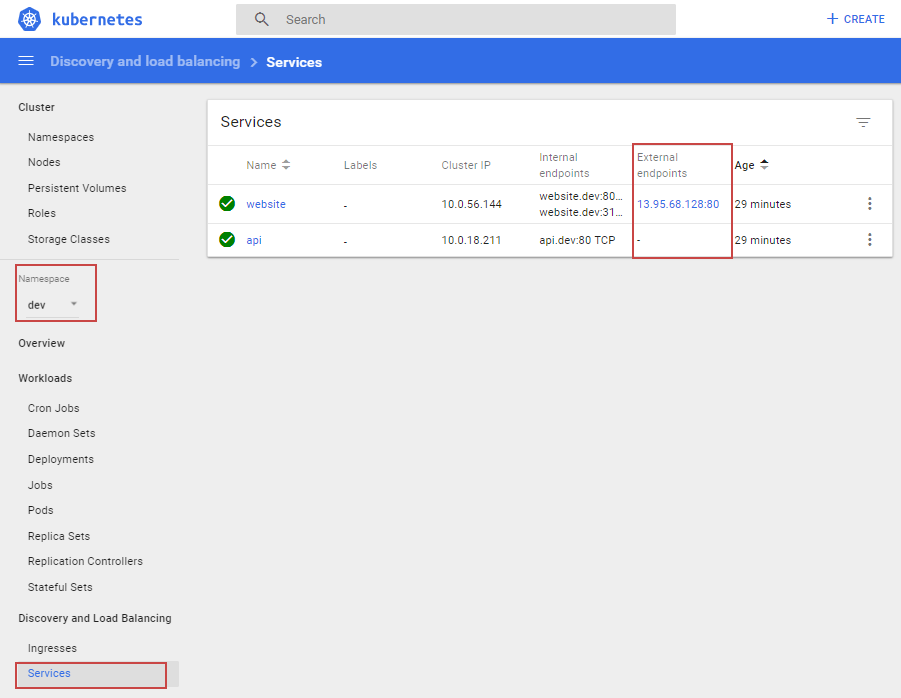

[](../../README.md)

# Working with the Kubernetes CLI

## Open the terminal in VS Code

Locate the file under 'Source/YAML/YAML-CommandLine/scripts.sh' right click and Open in Terminal


## Conntect to your AKS Cluster

In the Azure Portal open the overview page of the AKS Service and click on 'View Kubernetes Dashboard' and run the get credentials command in your terminal window

 


> Make sure you have previously run ```az login``` and are connected to the correct subscription. If not run ```az account set --subscription {your-subscription-id-here}```


## The AzureDemosRepo on Docker Hub

To make this section simple, we have provided a set of YAML templates that can be applied to your cluster with default config values. These YAML templates are using container images in our public [Docker Hub repository](https://cloud.docker.com/u/azuredemosrepo/repository/list)

This saves you the needing to push images to your registry, as we will cover that in the DevOps pipelines later.

## Run the following commands in the Terminal window

Deploy the API to the dev namespace in your cluster

```kubectl apply -f ./API/deployment-api.yaml --namespace=dev```

Delete any existings secrets for the website

```kubectl delete secret website-secret --namespace=dev```

Create a new secret for the website from the 'secret-website.json' file

```kubectl create secret generic website-secret --from-file=./Website/secret-website.json --namespace=dev```

Create or update the json config map

```kubectl apply -f ./Website/configmap-website.yaml --namespace=dev```

Delete any existing xml config maps

```kubectl delete configmap config-xml-website --namespace=dev```

Create config map from the 'configmap-website.xml' file

```kubectl create configmap config-xml-website --from-file=./Website/configmap-website.xml --namespace=dev```

Create or update the website

```kubectl apply -f ./Website/deployment-website.yaml --namespace=dev```

# View the deployed application

Now run the open dashboard command as shown in the portal

 

A new window should open in your browser with the Kubernetes dashbaord. 

1. Select the dev namespace
2. Click Services
3. Wait a minute for the pulic IP Address to be assigned (refresh screen)
4. Open the external enpoint for the website


 

 


## Finally, clear everything in the dev namespace again

We are not deleting the secrets as we want to keep the 'acr-auth' secret to allow us to pull images from your Azure Container registry later. 

```kubectl delete daemonsets,replicasets,services,deployments,pods,configmaps,rc --namespace=dev --all```


# Next Steps

### [Create Build Pipelines](../BuildPipelines)
