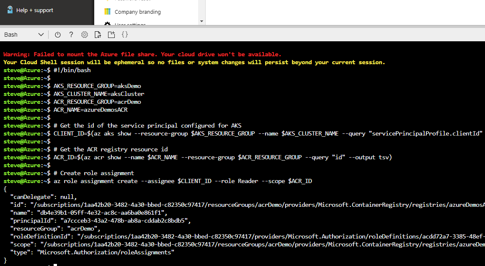
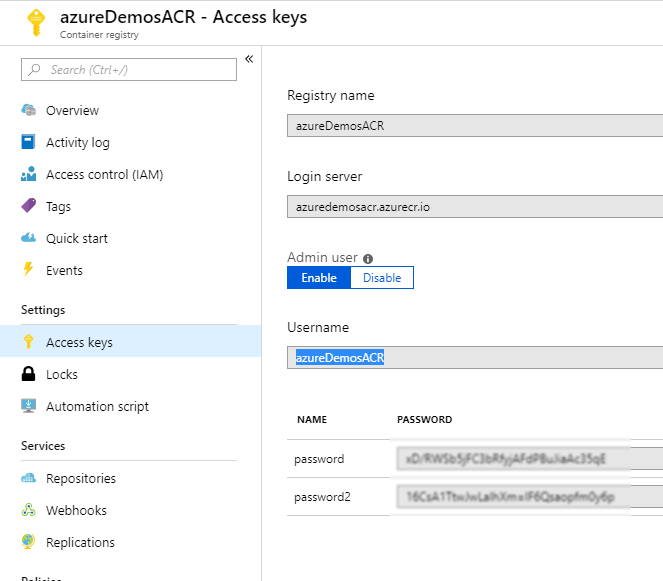
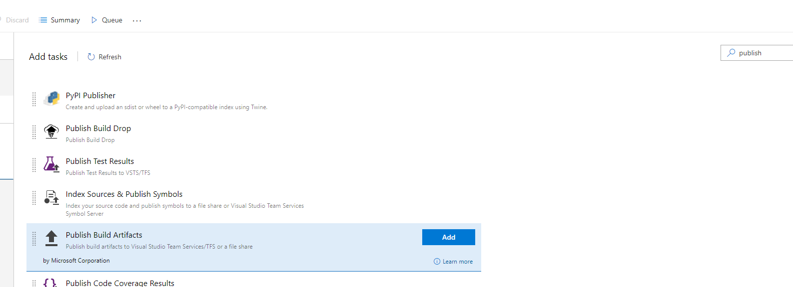
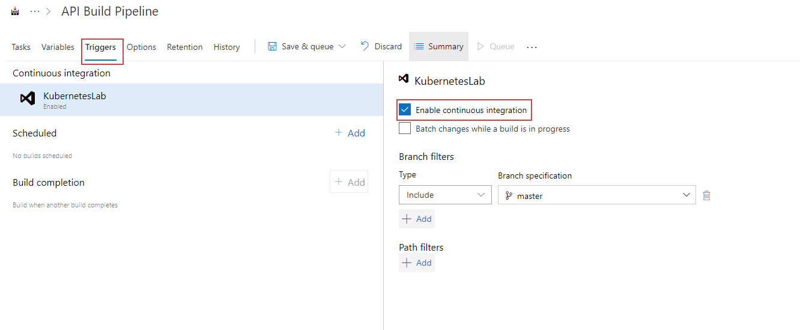

## Setup Docker for Windows

Install Docker for Windows - link

Enable Kubernetes


### Alternativly, via the CLI 

You can view all contexts
```
kubectl config view
```

View you current context

```
kubectl config current-context  
```

Switch your current context

```
kubectl config use-context context-name-here
```

## Viewing you local dashboard

Firstly make sure you have installed the dashboard UI

```
kubectl create -f https://raw.githubusercontent.com/kubernetes/dashboard/master/src/deploy/recommended/kubernetes-dashboard.yaml
```

Now setup a proxy

```
kubectl proxy
```

Your dashboard will be made available here: http://localhost:8001/api/v1/namespaces/kube-system/services/https:kubernetes-dashboard:/proxy/

## Setting up our environment using the Azure CLI

### Create resource group

```
az group create --name aksDemo --location westeurope
```

### Create cluster with application routing

```
az aks create --resource-group aksDemo --name aksCluster --node-count 3 --enable-addons http_application_routing --generate-ssh-keys
```

### Create an Azure Container Registry

It may be worthwhile putting the registry in a different resource group to the cluster
```
az group create --name acrDemo --location westeurope
az acr create --resource-group acrDemo --name azureDemosACR --sku Basic
```

## Authenticate with Azure Container Registry from Azure Kubernetes Service

When you're using Azure Container Registry (ACR) with Azure Kubernetes Service (AKS), an authentication mechanism needs to be established. To allow the cluster to access your ACR run the following command. 

```
#!/bin/bash

AKS_RESOURCE_GROUP=myAKSResourceGroup
AKS_CLUSTER_NAME=myAKSCluster
ACR_RESOURCE_GROUP=myACRResourceGroup
ACR_NAME=myACRRegistry

# Get the id of the service principal configured for AKS
CLIENT_ID=$(az aks show --resource-group $AKS_RESOURCE_GROUP --name $AKS_CLUSTER_NAME --query "servicePrincipalProfile.clientId" --output tsv)

# Get the ACR registry resource id
ACR_ID=$(az acr show --name $ACR_NAME --resource-group $ACR_RESOURCE_GROUP --query "id" --output tsv)

# Create role assignment
az role assignment create --assignee $CLIENT_ID --role Reader --scope $ACR_ID
```



More info on this can be found here: https://docs.microsoft.com/en-us/azure/container-registry/container-registry-auth-aks

You may also need to enable the admin user role of your Azure Container Registry 



## Create Azure DevOps Project


## Import Repo


New build pipeline


Create empty piple line


linux agent - name it


add docker build step


API build step


Push API Build


Publish Build Artificats




Enable CI


