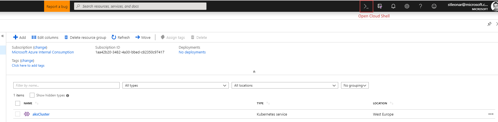
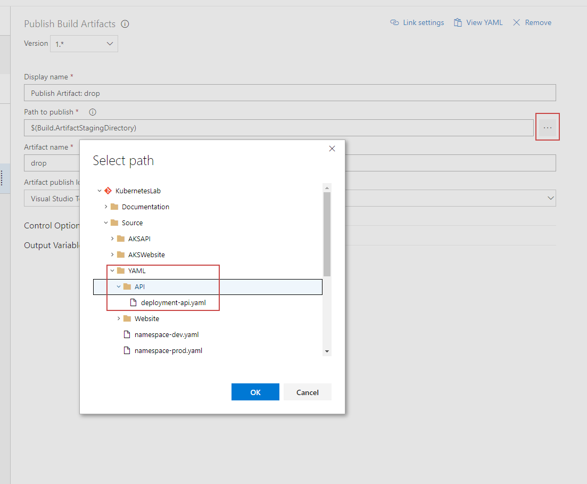

## Setup Docker for Windows

Install Docker for Windows - link

Enable Kubernetes


### Alternativly, via the CLI 

You can view all contexts
```
kubectl config view
```

View you current context

```
kubectl config current-context  
```

Switch your current context

```
kubectl config use-context context-name-here
```

## Viewing you local dashboard

Firstly make sure you have installed the dashboard UI

```
kubectl create -f https://raw.githubusercontent.com/kubernetes/dashboard/master/src/deploy/recommended/kubernetes-dashboard.yaml
```

Now setup a proxy

```
kubectl proxy
```

Your dashboard will be made available here: http://localhost:8001/api/v1/namespaces/kube-system/services/https:kubernetes-dashboard:/proxy/

## Setting up our environment using the Azure CLI

### Create resource group

```
az group create --name aksDemo --location westeurope
```

### Create cluster with application routing and role based access control

```
az aks create --resource-group aksDemo --name aksCluster --node-count 3 --enable-addons http_application_routing --generate-ssh-keys -r
```

### Create an Azure Container Registry

It may be worthwhile putting the registry in a different resource group to the cluster
```
az group create --name acrDemo --location westeurope
az acr create --resource-group acrDemo --name azureDemosACR --sku Basic
```

## Authenticate with Azure Container Registry from Azure Kubernetes Service

When you're using Azure Container Registry (ACR) with Azure Kubernetes Service (AKS), an authentication mechanism needs to be established. 

Run this script in the Azure Portal cloud shell to create a new service principal with read only access to your registry. Make sure to replace ```**YOUR_ACR_NAME**``` with the name of your registry.

> Make surte to take note of the Service principal ID and Service principal password from the output



```
#!/bin/bash

ACR_NAME=**YOUR_ACR_NAME**
SERVICE_PRINCIPAL_NAME=**YOUR_ACR_NAME**-acr-service-principal

# Populate the ACR login server and resource id.
ACR_LOGIN_SERVER=$(az acr show --name $ACR_NAME --query loginServer --output tsv)
ACR_REGISTRY_ID=$(az acr show --name $ACR_NAME --query id --output tsv)

# Create a 'Reader' role assignment with a scope of the ACR resource.
SP_PASSWD=$(az ad sp create-for-rbac --name $SERVICE_PRINCIPAL_NAME --role Reader --scopes $ACR_REGISTRY_ID --query password --output tsv)

# Get the service principal client id.
CLIENT_ID=$(az ad sp show --id http://$SERVICE_PRINCIPAL_NAME --query appId --output tsv)

# Output used when creating Kubernetes secret.
echo "Service principal ID: $CLIENT_ID"
echo "Service principal password: $SP_PASSWD"
```

## Create a Kubernetes Secret

Now we've created a service principal that has read access to our registry, we can create an image pull secret in Kubernetes that the deployments will use later.


More info on this can be found here: https://docs.microsoft.com/en-us/azure/container-registry/container-registry-auth-aks

You may also need to enable the admin user role of your Azure Container Registry 


## Create Azure DevOps Project


## Import Repo


New build pipeline


Create empty piple line


linux agent - name it


add docker build step


API build step


Push API Build


Publish Build Artificats


Choose the folder to publish




Enable CI


