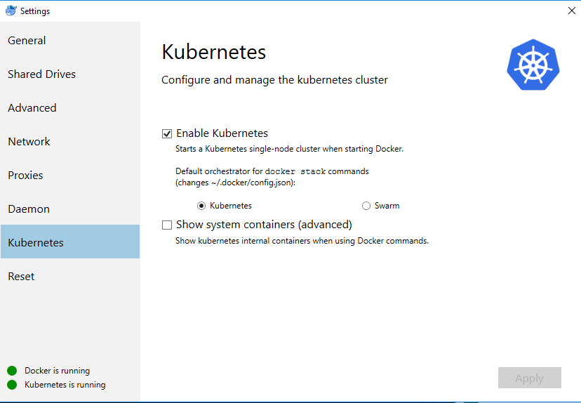
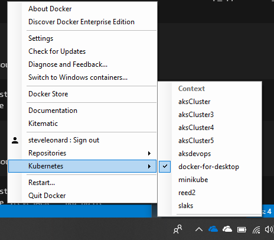
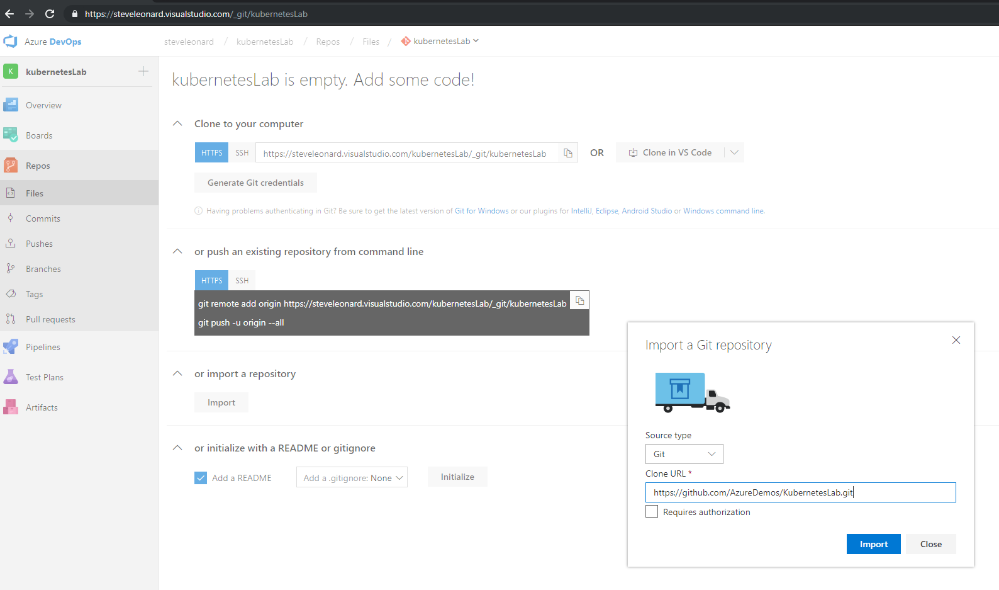
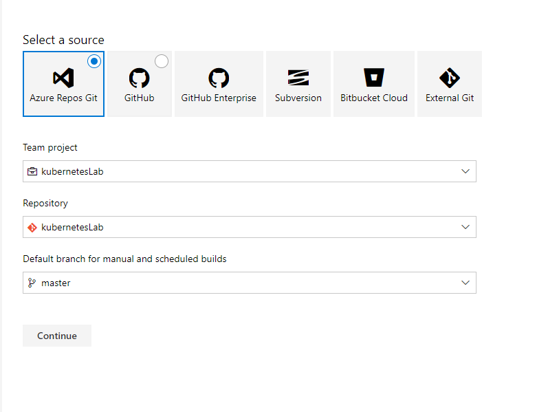
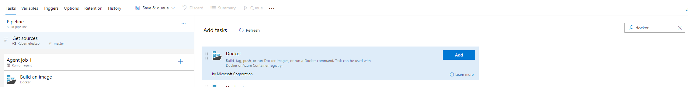
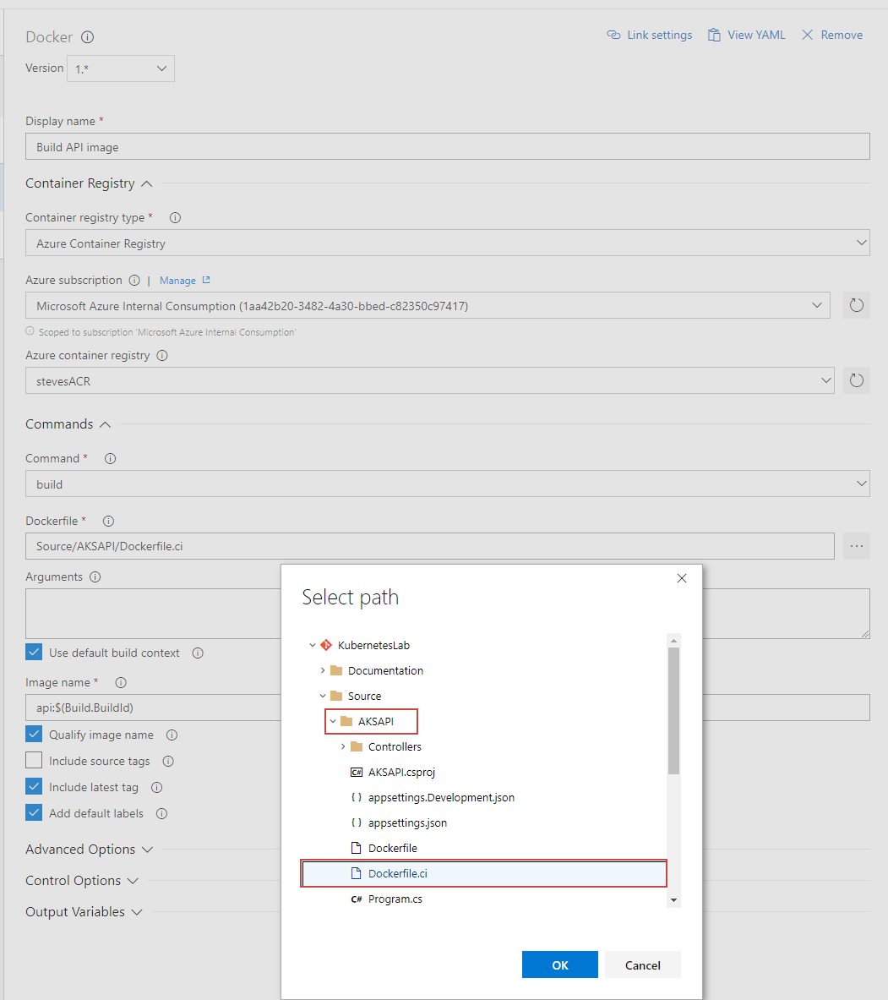
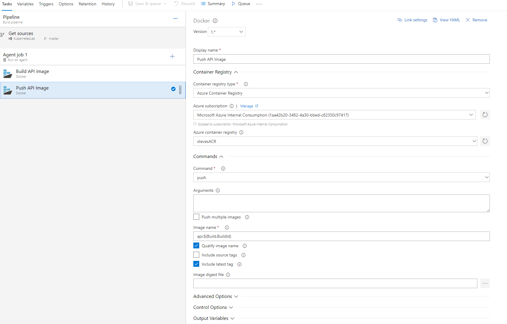

## Setup Docker for Windows

Install Docker for Windows - link

Enable Kubernetes





### Alternativly, via the CLI 

You can view all contexts
```
kubectl config view
```

View you current context

```
kubectl config current-context  
```

Switch your current context

```
kubectl config use-context context-name-here
```

## Viewing you local dashboard

Firstly make sure you have installed the dashboard UI

```
kubectl create -f https://raw.githubusercontent.com/kubernetes/dashboard/master/src/deploy/recommended/kubernetes-dashboard.yaml
```

Now setup a proxy

```
kubectl proxy
```

Your dashboard will be made available here: http://localhost:8001/api/v1/namespaces/kube-system/services/https:kubernetes-dashboard:/proxy/

## Setting up our environment using the Azure CLI

### Create resource group

```
az group create --name aksDemo --location westeurope
```

### Create cluster with application routing

```
az aks create --resource-group aksDemo --name aksCluster --node-count 3 --enable-addons http_application_routing --generate-ssh-keys
```

### Create an Azure Container Registry

It may be worthwhile putting the registry in a different resource group to the cluster
```
az group create --name acrDemo --location westeurope
az acr create --resource-group acrDemo --name stevesACR --sku Basic
```

### Create an Azure Container Registry

It may be worthwhile putting the registry in a different resource group to the cluster
```
az group create --name acrDemo --location westeurope
az acr create --resource-group acrDemo --name azureDemosACR --sku Basic
```

## Create Azure DevOps Project


## Import Repo


New build pipeline



Create empty piple line


linux agent - name it


add docker build step




API build step



Push API Build


