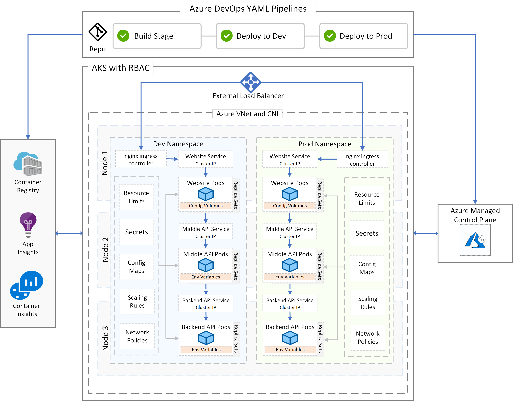

# Kubernetes Lab

Welcome to the Kubernetes Lab. This lab is designed to demonstrate how to build a Dot Net Core application and deploy it into Kubernetes on Azure (AKS). The lab leverages native Kubernetes components such as config maps and secrets, along with Azure based technologies such as Azure DevOps, Azure Container Registry, Log Analytics and Application Insights.

## Lab Architecture and Technologies 

## Guided Walkthrough

### [1. Prerequisites](WalkthroughGuide/Prerequisites.md)

### [2. Creating AKS Cluster](Documentation/CreateEnvironment)

### [3. Setup Azure DevOps project](WalkthroughGuide/devopsproj.md)

### [4. Run the code locally in Visual Studio](WalkthroughGuide/runcodelocally.md)

### [5. Create Build Pipelines](WalkthroughGuide/buildpipelines.md)

### [5. Create Release Pipelines](WalkthroughGuide/releasepipelines.md)

### [6. Make a code change by adding Application Insights](WalkthroughGuide/codechanges.md)

### [7. Monitoring the application with Log Analytics and Application Insights](WalkthroughGuide/codechanges.md)

